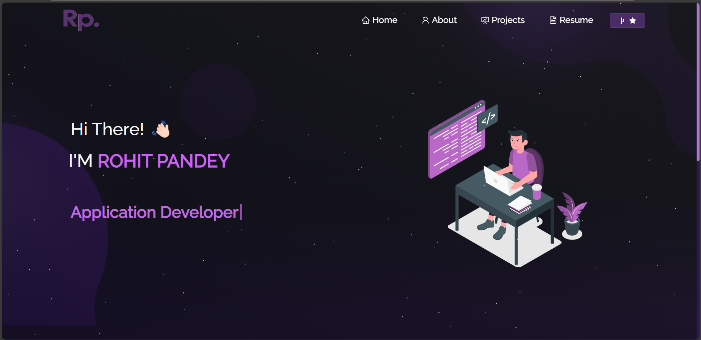

Portfolio Website
A dynamic and interactive portfolio website built using React, Node.js, Express, and CSS. This website showcases projects, skills, and experience in a modern and responsive design.

🚀 Features
🌐 Multi-Page Layout – Organized sections for projects, about, and contact.

🎨 Styled with CSS – Customizable styles with modern UI/UX.

⚡ Fast & Responsive – Optimized for performance and mobile-friendly.

🔄 API Integration – Uses Node.js and Express.js for backend support.

🛠 Built With
React.js – Frontend framework for interactive UI.

Node.js & Express.js – Backend for handling requests and API integration.

CSS3 – Custom styling and animations.

🏗 Getting Started
Prerequisites
Ensure you have Node.js and npm installed.

Installation
Clone the repository:

sh
Copy
Edit
git clone https://github.com/yourusername/portfolio.git
cd portfolio
Install dependencies:

sh
Copy
Edit
npm install
Start the development server:

sh
Copy
Edit
npm start
Open http://localhost:3000 to view in the browser.

📌 Usage
Navigate to the /src/components/ folder to customize content.

Update project details, skills, and about sections as needed.

🤝 Contributing
Feel free to fork this repository, make modifications, and submit pull requests!

⭐ Show Your Support
If you like this project, consider giving it a star! 🚀
